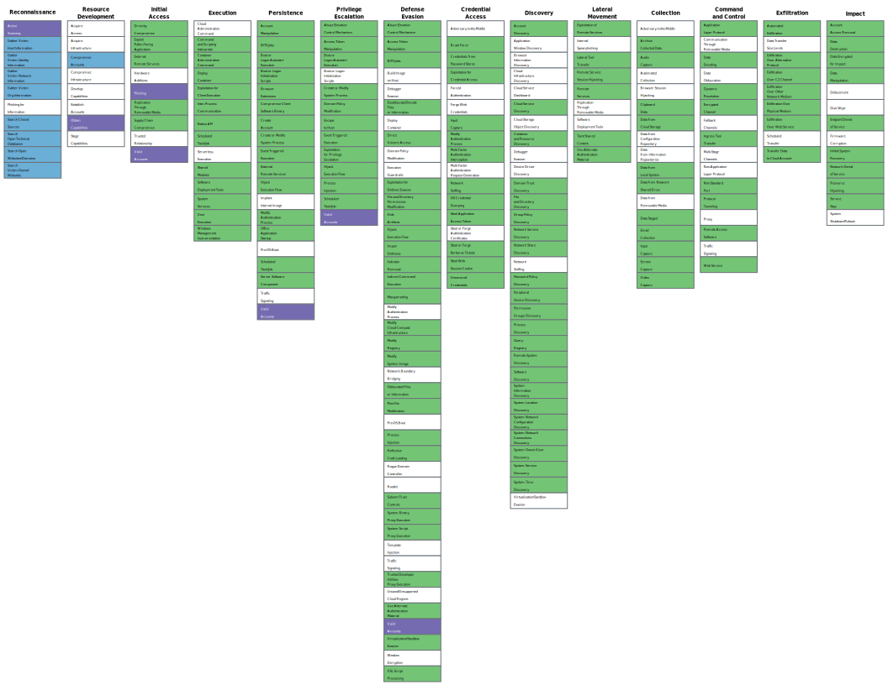

.. _coverage:

**********************
Mitre Attack Coverage
**********************

As mentioned in the :ref:`SATAYO Items<satayo-items>` page, every item within SATAYO is mapped with the :command:`MITRE ATT&CK Framework`.
The framework is a globally-accessible knowledge base of adversary tactics and techniques. The following image shows the tactics and techniques covered by |witit| cyber security products.

In the matrix below, each cell represents a technique, while the columns represent the tactics. We tried to represent the coverage provided by |witit| services and platform in terms of techniques and tactics defined in the MITRE ATT&CK framework. You can find more information about the framework at `MITRE ATT&CK official website <https://attack.mitre.org/>`_.

We defined a color scheme in order to represent the coverage. Colors used are to be interpreted as follow:

+ BLUE: Area covered by SATAYO
+ PURPLE: Area covered by both SATAYO and |witit|'s :abbr:`SOC (Security Operation Center)`
+ GREEN: Area covered by :abbr:`SOC (Security Operation Center)` detection rules

We recommend you open the image in another tab and zoom in to read it properly.
