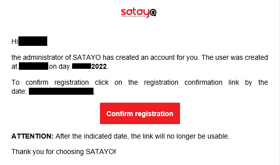
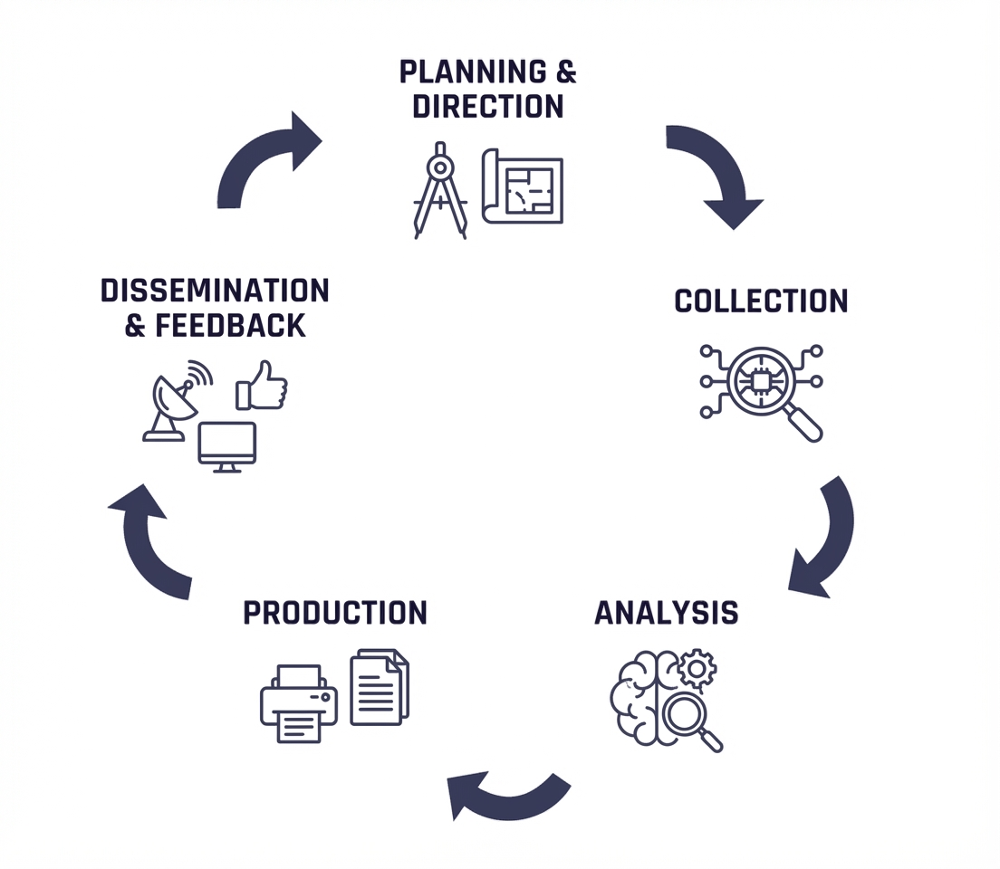
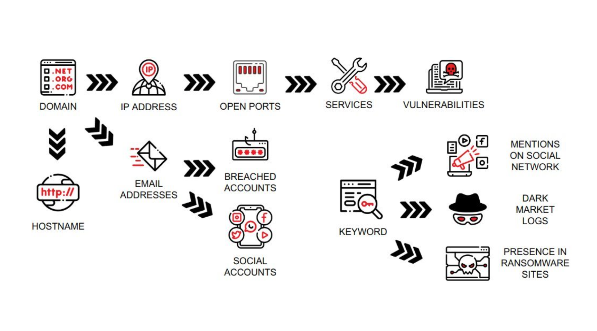
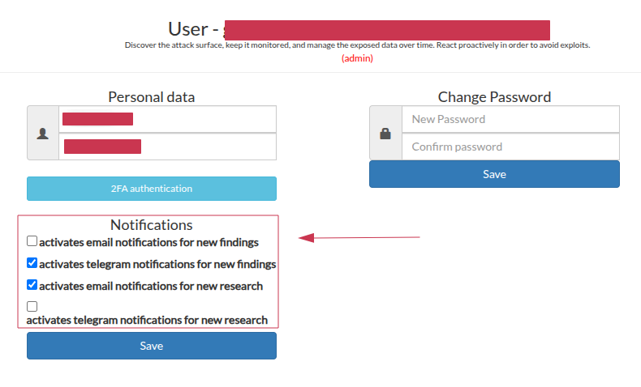
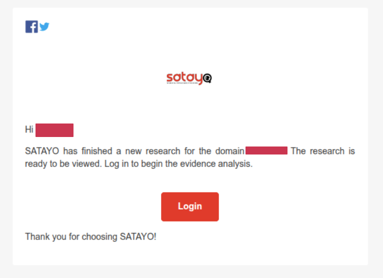
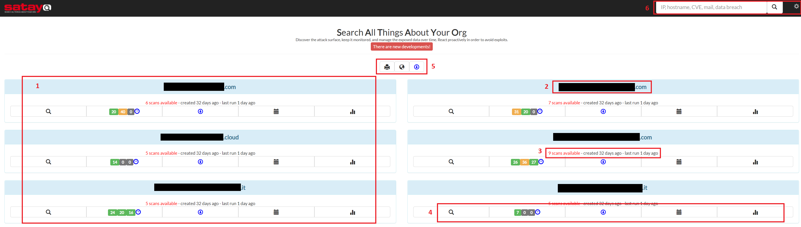
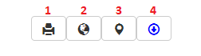
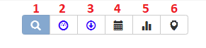

.. _getting-started:

*****************
Getting Started
*****************

**You don't have SATAYO but are interested in it? Contact us!**

|
|

Registration
=============

The registration process is quite simple. First your company will be added into SATAYO and then the various scans will begin.
Accounts for your users will be created by us and you will receive an email with a link to finalize the registration.

.. note::
    We recommend you to set the :abbr:`2FA (Second Factor Authentication)` from the settings to further protect your account. To do so go to :ref:`Settings -> User Information<user-info>`.
    At the moment, 2FA is supported by the Google Authenticator application, which is available for all smartphones.

|
|

.. _how-SATAYO-works:

How does SATAYO work
=====================

.. _intellige-lifecycle:

The SATAYO platform and its related services treat the continuous monitoring of an organization’s digital footprint, for better satisfying the needs, the service was modelled using the Intelligence lifecycle as a reference model. Starting from the assets provided during the onboarding phase, they could be considered part of the information required, that rappresent the identity of the organization and its context; the platform collects, processes, and analyzes data from multiple OSINT sources to identify potential threats for the organisation.

The cycle is composed of multiple phases that are continuously repeated to ensure that the intelligence remains up-to-date and relevant. It ends with a feedback stage that allows to refine the requirements and improve the overall process.

.. note::
    It is essential to recognize that the process originates from the requirements. While the desired service outcome was defined during the onboarding phase, it is also necessary to establish the initial scope and identify the elements the service will be responsible for monitoring. For this reason, we specified a section in this guide dedicated to it.

After the definition the :ref:`requirement<intelligence-requirements>` (scope of the service) and determined the planning of the activity, the intelligence lifecycle comprehend a proper way to retrieve the data and normalize it. SATAYO integrates a wide variety of different tools to perform the collection.

The search process is based on the asset **domains** that were previously identified, mapped, and configured during the onboarding engagement with a SATAYO analyst.
The primary workflow used by the SATAYO engine consists of multiple scans performed to assess the status of the monitored perimeter at a specific point in time. Each scan leverages a dedicated probe to collect asset-related data. Starting from the domain level, SATAYO independently reconstructs and continuously learns the infrastructure to be monitored.

Keywords are leveraged to detect data and information that are not directly associated with the identified perimeter but are useful for deriving contextual insights and identifying elements that represent the customer’s identity.
A typical use case involves the application name of an Android app, which can be used to identify additional applications maliciously crafted to impersonate the legitimate one.

Every **two months** a new exhaustive search starting from the domain assets is launched and the result is stored and saved as snapshot. This activity is a recursive process that compares all new findings to the previous results, to show how the situation has changed.

Old searches remain available and can be checked in the :ref:`History<history>` section.
During the two months some other granular scans are run daily or weekly and continue to update the :ref:`SATAYO Items<satayo-items>`.
In the settings you can set up an e-mail or telegram notification if you want to be notified of new research or discoveries.

The notifications settings page let you choose which events to be notified about and how. They will be available notifications for new research and for findings, the research notifications will be sent when a new scan is completed that will happen every two months, while the findings notifications will be sent when new items are discovered during the daily or weekly scans.
It can be possible to define if to receive notifications by email, telegram or both.

An example of an alert received by email is shown below:

It must be noted that in case of managed service, a different alert will be sent when a new ticket is created by our analysts, as explained in the section :ref:`Managed Service<jiraalert>`.

The evidences collected by SATAYO are ordered in multiple :ref:`Items<satayo-items>` that can be reviewed.
A number called **Exposure Assessment Index Value (EAIV)** is calculated based on the evidences and highlights the :command:`Exposure Assessment` of the domain.
This value ranges from **0** to **100**, where zero means no exposure at all and 100 is the maximum value.
The higher the value, the higher the possible attack surface, with more information available online and potentially exploitable by threat actors.
Of course, as the company gets bigger, so will the score.

The items are divided into three major categories called **INFRASTRUCTURE**, **DATA FILES & PEOPLE** and **DEEP & DARK WEB**.
The Exposure Assessment is evaluated on them. You can download a :ref:`Global Report<global-report>` containing the data of all monitored domains
or a :ref:`Domain Report<domain-report>` for a single domain.

Scan times by type of object
-----------------------------

The following table lists the details of how often each scan is performed according to the type of item. All the evidences are described in details in the page :ref:`SATAYO Items<satayo-items>`.

+--------------------+-------------+
| ITEM               | PERIODICITY |
+====================+=============+
| HOSTNAME/IP        | 60 days     |
+--------------------+-------------+
| IP BLOCK           | 60 days     |
+--------------------+-------------+
| PORTS              | 60 days     |
+--------------------+-------------+
| DOMAIN SUSPICIOUS  | every day   |
+--------------------+-------------+
| DOMAIN CORRELATED  | 60 days     |
+--------------------+-------------+
| DOMAIN SIMILAR     | every day   |
+--------------------+-------------+
| DOMAIN TLD         | 60 days     |
+--------------------+-------------+
| DOMAIN PHISHING    | every day   |
+--------------------+-------------+
| FILE               | 60 days     |
+--------------------+-------------+
| VULNERABILITY      | every week  |
+--------------------+-------------+
| PHONE NUMBER       | 60 days     |
+--------------------+-------------+
| GENERAL SOCIAL     | 60 days     |
+--------------------+-------------+
| MAIL SERVER        | 60 days     |
+--------------------+-------------+
| BUCKET             | 15 days     |
+--------------------+-------------+
| MOBILE APPS        | 60 days     |
+--------------------+-------------+
| EMAIL              | every day   |
+--------------------+-------------+
| SOCIAL & SERVICES  | 15 days     |
+--------------------+-------------+
| BREACHED ACCOUNTS  | every day   |
+--------------------+-------------+
| PASSWORD           | every day   |
+--------------------+-------------+
| OPEN BUG BOUNTY    | every week  |
+--------------------+-------------+
| TELEGRAM           | every day   |
+--------------------+-------------+
| TWITTER            | every day   |
+--------------------+-------------+
| DARK WEB FORUMS    | every day   |
+--------------------+-------------+
| DATA LEAK SITES    | every day   |
+--------------------+-------------+
| LOG STEALER MARKET | every day   |
+--------------------+-------------+
| SANDBOXES          | every day   |
+--------------------+-------------+
| CREDIT CARD        | every day   |
+--------------------+-------------+

IP Whitelisting
-----------------------------

The whitelist of the network :command:`82.193.25.0/24` is requested. Whitelisting this network, which is used to manage active scanning activities and that is  `managed directly <https://apps.db.ripe.net/db-web-ui/lookup?source=ripe&key=82.193.25.0%20-%2082.193.25.255&type=inetnum>`_ by Wurth IT Italy, is strongly recommended to allow SATAYO to obtain more consistent information about the services exposed on the infrastructure being analyzed.

|
|

The SATAYO platform
====================

After the login you will face a page similar to this one:

Click on the image to enlarge it

1. All the domains in your organization that have been analyzed by SATAYO. The number depends on how many domains you have.
2. The name of the analyzed domain. Data is obscured in this picture for privacy reasons.
3. Information about the number of performed scans.
4. The options available for each domain. Better explained in the section, :ref:`Domain Options<domain>`.
5. The global options valid for all domains listed in the page. More information in :ref:`Global Options<global>`.
6. The search bar and the settings. More information in :ref:`Settings<settings>`.

|

.. _global:

Global options
---------------

The global options. Read below for more details.

.. _global-report:

1. Report - Global Executive Summary
~~~~~~~~~~~~~~~~~~~~~~~~~~~~~~~~~~~~~

The button with the printer emoji lets you download a document called "*Global Executive Summary*". Inside you will find a summary of the critical issues
retrieved by SATAYO for all the domains that are being monitored. Details about the :command:`Exposure Assessment Index Value` can be found within this document.

A report like this is available for each domain, as shown in the section :ref:`Domain Report<domain-report>`, and contains more detailed information about the analyzed evidences.

.. _global-overview:

2. Global Overview
~~~~~~~~~~~~~~~~~~~

This button provides a global overview of evidence collected across multiple domains. It is particularly useful in case you want to check, for example,
all vulnerabilities in the monitored perimeter without entering each domain individually. The global overview is available for vulnerabilities, markets, sandboxes and domains.
Findings related to VIP accounts (breached accounts and exposed passwords) are also shown here.

3. Interactive Network Visualization
~~~~~~~~~~~~~~~~~~~~~~~~~~~~~~~~~~~~~

This is a visualization that highlights all the relationships between the analyzed domains. You can drag and drop elements, but it is still in beta and we are
working on a new version, with which it will be easier to interact.

4. Export
~~~~~~~~~~

The export section, accessible through the third button, allows you to download in different formats (csv, plain text and json)
the collected resources for all domains. If you are interested in downloading evidence for a single domain only, you can access the report section from it,
as described in :ref:`Domain Export<domain-export>`.

|

.. _domain:

Domain options
---------------

These options visible from the home page are also available once you enter one of the subcategories.

The domain options. Read below for more details.

1. Research
~~~~~~~~~~~~

This is the page where all the items collected by SATAYO are shown. Complete information about these objects can be found in the page :ref:`SATAYO Items<satayo-items>`.

.. _domain-report:

2. Report
~~~~~~~~~~

From this page you can download the report of the various evidences collected by SATAYO for the selected domain. The scoring of the three main sections of the report
is shown and each section can be consulted directly from this page. A summary of the findings with a description of how the score was calculated is also available.
The definition of the number was given earlier, in the section :ref:`Global Report<global-report>`.
In addition to this, the number of assets managed for the domain is indicated.

.. _domain-export:

3. Export
~~~~~~~~~~

From this section you can download the data collected for the chosen domain. Several formats are available, such as csv, plaintext or json .
You can also generate an API token and send API requests to download the content without having to log in.
The token is unique for all users in the company.

.. _history:

4. Historical Researches
~~~~~~~~~~~~~~~~~~~~~~~~~

From here it is possible to browse previous searches done by SATAYO and take a look at what has been found before. You can also see if the overall situation is
getting worse or better as the time passes. Statistic can also be viewed from the appropriate page.

5. Statistic
~~~~~~~~~~~~~

This section shows the comparison between different searches, so at least two are needed to see a trend in the graphs. You can interact with the charts
and click on an element to disable it and get a better view of the rest.
The following graphs are available within the section, showing the evolution over time of:
+ score (EAIV)
+ total assets managed
+ infrastructure
+ data, files & people
+ deep & dark web

6. Interactive Network Visualization
~~~~~~~~~~~~~~~~~~~~~~~~~~~~~~~~~~~~~

Similar to the visualization present in the global menu, this time it shows only the relationships between IPs and hostnames of the selected domain.

|

Tables
---------------

Evidences in SATAYO are organized in tables and it's possible to filter data from any column. More advanced filters such as AND, OR, NOT operators, regular expressions and more are possible.
The complete list and some examples are available `here <https://github.com/koalyptus/TableFilter/wiki/4.-Filter-operators>`__.

|
|

.. _ticket-opening:

Tickets
========

The operation of tickets is explained in the page :ref:`Managed Service<managed>`.
