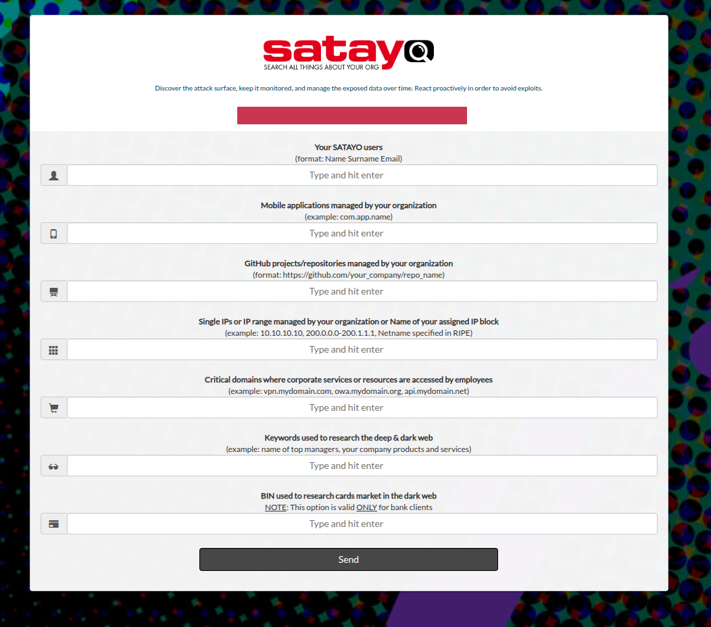
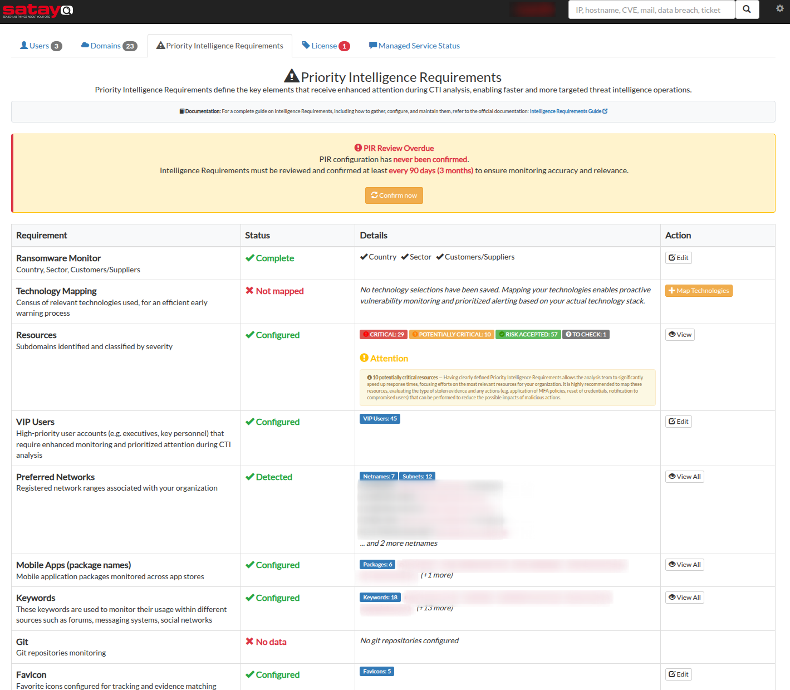
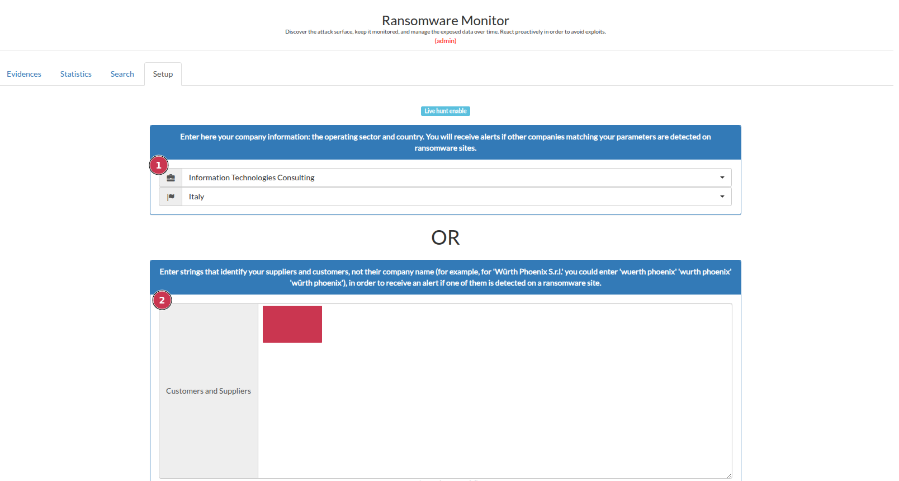
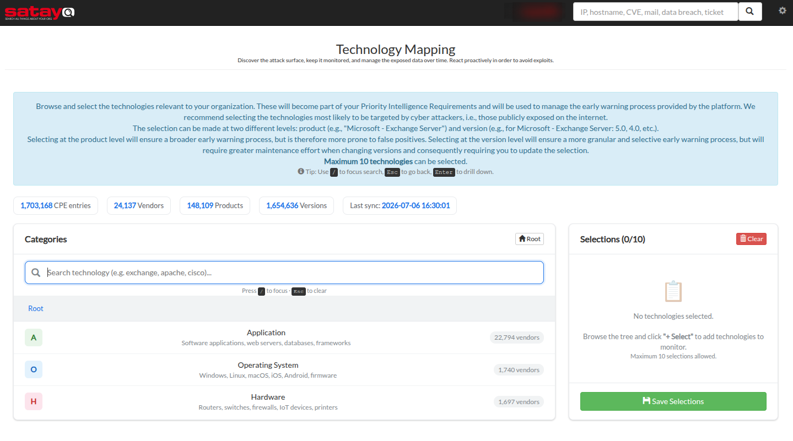
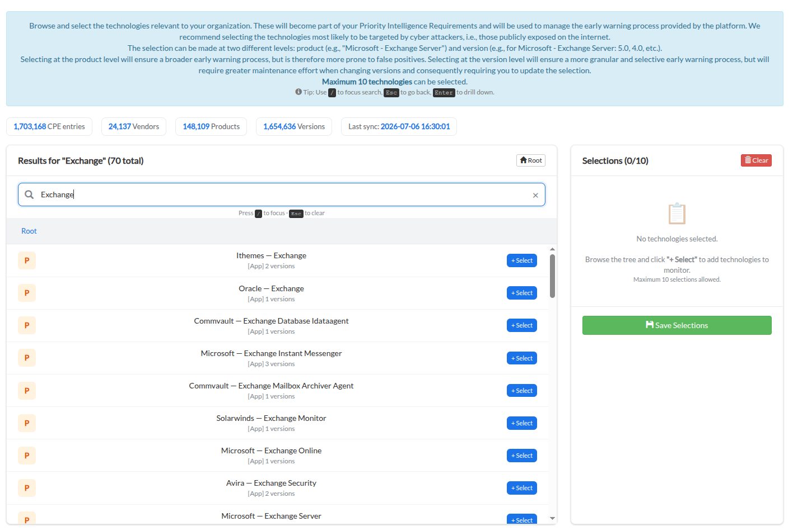
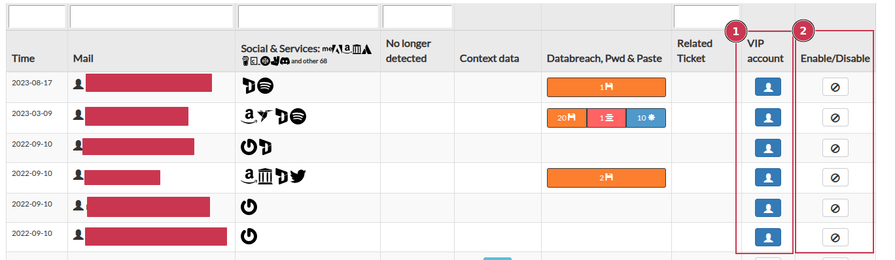
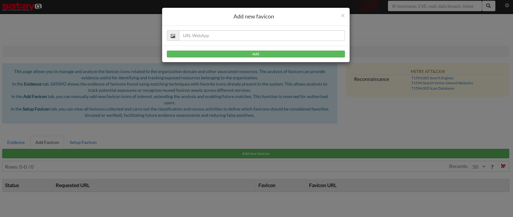
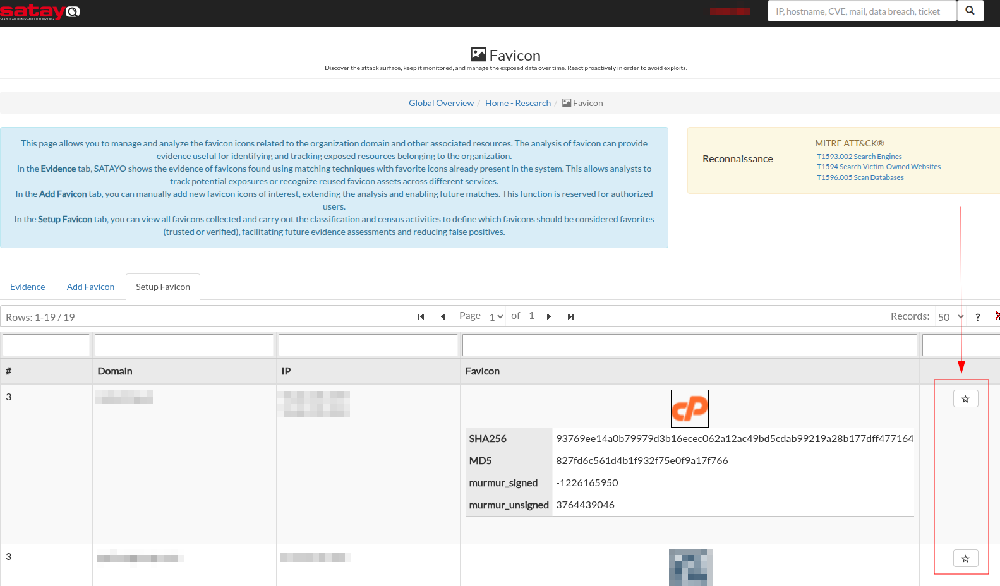

.. _intelligence-requirements:

***************************
Intelligence Requirements
***************************

General info
=============

As mentioned in the :ref:`getting started<intellige-lifecycle>` page, Intelligence Requirements phase document outlines the specific needs and criteria for intelligence gathering and analysis within an organization. It serves as a foundational guide for intelligence operations, ensuring that all activities align with the strategic objectives and priorities of the organization.
In the context of SATAYO platform, it assists in defining the scope and focus of intelligence efforts, enabling more effective decision-making and resource allocation.

The first step in collecting the Requirements is to identify the what can be considered relevant for routines performed by SATAYO and its related workflow.

Gathering the Requirements
===========================

For better achieving this phase, we defined an introctive questionnaire that could be used as a reference during the onboarding phase. The form could be compiled together with the analyst who will conduct the onboarding phase, or it could be filled independently by the organization.

The following are the items that the organization is required to provide:

+ Name, surname, and email address of people who need to access the platform
+ Mobile applications published on different stores for products and services managed by the organization
+ Repositories hosted on GitHub for projects managed by the organization
+ IP addresses and IP blocks managed directly
+ Exposed resources and assets considered critical
+ List of keywords useful for identifying products and services managed by the organization
+ BIN (Bank Identification Number) for credit cards issued by the organization (if operating in the banking/financial sector)
+ List of technologies that are considered a priority for the management of Early Warning on the same

SATAYO also provides multiple sections for autonomous configuration of some monitoring elements, such as keywords, domains, and social media accounts.

.. _maintain-req:

Maintaining the Requirements
~~~~~~~~~~~~~~~~~~~~~~~~~~~~

The requirements are not static and may evolve over time due to changes in the organization's operations, market conditions, or emerging threats. Therefore, it is essential to establish a process for regularly reviewing and updating the intelligence requirements to ensure they remain relevant and effective. 

For this reason, SATAYO platform provides a periodic confirmation workflow for Priority Intelligence Requirements with overdue review alert. A dedicated section is available in the :ref:`Manage Your Org<manage-your-org>` page, where the organization can review and update its requirements as needed. 
The CTI team will review and validate the request and, if permitted under the current license, the perimeter will be updated accordingly.

In this page, the organization can review and update its requirements as needed. 

+ 1. Ransomware monitor keywords, country sector and identity information could be updated by clicking on the "Edit" button.
+ 2. Technology mapping, users can define the technologies that are relevant for the management of Early Warning on the same. The list could be updated by clicking on the "Edit" button.
+ 3. Resources and assets, users can define the list of exposed domains and assets considered critical. The list will help in prioritizing the monitoring efforts on the organization's digital assets. The list could be reviewed by clicking on the "View" button.
+ 4. VIP Email addresses, users can define the list of sensible email addresses because they may be associated with key personnel or sensitive information. The list could be updated by clicking on the "Edit" button.
+ 5. Preferred Network, users can define the list of preferred networks considered associated with the organization's online perimeter. The list could be reviewed by clicking on the "View" button.
+ 6. Mobile applications, users can define the list of mobile applications maintained or produced by the organization and their customers. The list could be reviewed by clicking on the "View" button.
+ 7. Keyowords, users can define the list of keywords that are considered relevant for monitoring because they may be associated with the organization's identity. It may cover the organization's brand, products, services, and other important terms. The list could be reviewed by clicking on the "View" button.
+ 8. Git repositories, users can define the list of Git repositories that could contain organization-specific information or codebase. The list could be reviewed by clicking on the "View" button.
+ 9. Favicon items, users can define the list of legitimated favicon icons that are associated with the organization's online assets like istitutional sites or public-facing services. The list could be updated by clicking on the "Edit" button.

.. note::
    For each section that requires review, it can be updated by opening a ticket or directly discussing it with the CTI team via the support channels.

Define keywords and identity for Ransomware Monitor
~~~~~~~~~~~~~~~~~~~~~~~~~~~~~~~~~~~~~~~~~~~~~~~~~~~

The Ransomware Monitor section allows you to define keywords and identity information that will be monitored for potential threats related to ransomware activities. By specifying relevant keywords and identity details, the organization can enhance its ability to detect and respond to ransomware threats in a timely manner.

This section allows the input of keywords commonly used in ransomware-related communications, as well as identity-related information that may be targeted by ransomware actors. It helps tailor the monitoring process to the organization’s specific context.

The purpose of this section is to enhance the organization’s ability to detect and respond to ransomware threats by focusing on relevant keywords and identity information, while also identifying any incidents that could potentially lead to a **supply chain attack**.

|

+ 1. Define keywords and geographic areas that could be relevant for monitoring.
+ 2. Specify keywords that could be relevant for monitoring ransomware-related activities and incidents (When setting keywords, consider the ransomware gangs' modus operandi when publishing the names of victim organizations. The exact name of the victim company is unlikely to be published (for example, **$Company_Name GMBH** is unlikely to be published, but **$Company_Name** is more likely).

Define Technologies for Early Warning
~~~~~~~~~~~~~~~~~~~~~~~~~~~~~~~~~~~~~~

The technology mapping section allows you to define the technologies that are considered a priority for the management of Early Warning on the same. By specifying relevant technologies, the CTI team can enhance its ability to detect and respond to potential threats related to the organization's technology stack. Early Warning on the same technologies can help identify vulnerabilities, or emerging threats that may impact the organization's systems and applications.

This section allows the input of technologies commonly used in the organization's systems and applications, as well as any associated components or dependencies. It helps tailor the monitoring process to the organization’s specific technology landscape.

|

+ 1. Select the technologies that are a priority for Early Warning.

Configuring VIP accounts
~~~~~~~~~~~~~~~~~~~~~~~~~

The email section allows you to define VIP accounts that require special monitoring attention. These accounts may belong to high-profile individuals within the organization, such as executives or key personnel, whose online presence and activities could be of particular interest for security monitoring. Also it lets you specify unused email addresses realed to disabled or deprecated users or mailboxes.

Navigate to the "Email" section in the SATAYO platform. There you could find the list of monitored email addresses.

+ 1. Button let you define if an email belong to a VIP account.
+ 2. Button let you specify unused email addresses related to disabled or deprecated users or mailboxes.

.. note::
    SATAYO let you import also a list of personal email addresses that could be related to employees of the organization. A ticket can be :ref:`opened<tickets-opening>` using the request form to ask for the addition of other email addresses. More information about this feature could be found in the section :ref:`Email Monitoring<email-monitoring>`.

|

Import and configure legitimated favicon icon
~~~~~~~~~~~~~~~~~~~~~~~~~~~~~~~~~~~~~~~~~~~~~~~

As described in the :ref:`Favicon Items<favicon-items>` section, SATAYO platform allows you to import and configure legitimated favicon icons that are associated with the organization's online presence. By defining these icons, the organization can enhance its monitoring capabilities and improve the accuracy of threat detection related to its digital assets.

The favicon section allows you to upload and manage a list of favicon icons that are considered legitimate for the organization. In the first page you can set a legitimate URL, SATAYO will automatically fetch the related favicon icon and it will calculate its hash value for future monitoring activities.

Starting from the monitored URL, SATAYO will periodically check for any new favicons associated with the domain. If a new favicon is detected, it will reevaluate its hash value and it will store the new icon in the platform database. After that, the new favicon will presented to our CTI team for validation and eventual inclusion in the list of legitimated icons. You can directly force the addition of a new favicon by clicking on the "Star" button.

|

.. note::
    During the recoursive meeting with the organization, the analyst will review the form and discuss with the organization the answers provided, in order to clarify any doubts and ensure that all relevant aspects are covered.

    It is essential to have a clear understanding of the organization's needs and priorities to tailor the intelligence gathering process effectively, but using JIRA platform as a communication channel and periodic meetings, the analyst could **refine the requirements over time**, adapting to any changes in the organization's context or objectives.

    In the event of any change or update, the organization can align its requirements by opening a :ref:`JIRA ticket<tickets-opening>` and specifying :code:`SATAYO information request` as a section. The CTI team will review and validate the request and, if permitted under the current license, the perimeter will be updated accordingly.
