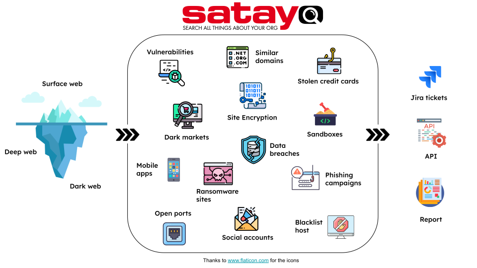

.. _introduction:

**************
Introduction
**************

:abbr:`SATAYO (Search All Things About Your Organization)` is part of |witit|'s cybersecurity services portfolio. The platform is part of a broader service offering that includes monitoring, analysis, and incident response support.
For delivering our services we adopted an adversarial perspective and we decided to map what our services can offer starting of they can mitigate. For better understanding this concept, we can refer a view based on the ATT&CK matrix developed by MITRE Corporation.
In :ref:`this matrix<coverage>` we highlighted the tactics and techniques that SATAYO and the other service we provide can help to mitigate.

|

SATAYO correlates information from multiple sources and provides an overview of your company from an outside perspective, highlighting vulnerabilities and
potential attack vectors exploitable by cybercriminals.
The data is collected through :abbr:`OSINT (Open Source INTelligence)` sources and is thus publicly available on the Internet.

Starting from the organization's domains, SATAYO performs daily scans of the Surface, Deep and Dark Web to collect items such as host names,
IPs, e-mails, data breaches and much more. The elements into which the information is classified are explained in detail in the section :ref:`SATAYO Items<satayo-items>`.

|
|

SATAYO service
===============

The SATAYO service is available in three different modalities:

+ One Time
+ SaaS (Software as a Service)
+ SaaS & Managed

The main difference lies in the way evidence is evaluated and what is collected.

:command:`One Time`: a single scan for the organisation's Internet domains. A report containing the collected evidence is delivered and discussed.
Access to the platform is provided (on a crystallised situation) for 2 weeks.
The following are not included in this version of the service: sandbox verification (e.g. VirusTotal), analysis of infostealer credentials (only metadata of detected records is given).

:command:`SaaS`: recurring scans, with the periodicity indicated at the link :ref:`How does SATAYO work<how-SATAYO-works>`.
The following are not included in this version of the service: sandbox verification (e.g. VirusTotal), analysis of infostealer credentials (only metadata of detected records is given).

:command:`SaaS & Managed`: recurring scans, with the periodicity indicated at the link :ref:`How does SATAYO work<how-SATAYO-works>`.
Included in this version of the service are: verification in sandboxes (e.g. virustotal), analysis of infostealer credentials (the acquisition from paid marketplaces is also included, up to 2% of the amount of the annual service subscription).
The |witit| cybersecurity team manages the analysis of suspicious results and tickets with mitigation instructions are opened in Jira for you. You are automatically notified when a new ticket is available.
You also have the option to open tickets on your own and request analysis of a specific piece of evidence that you feel is important. More information can be found in the section :ref:`Managed Service<managed>`.

For all the modalities of SATAYO this user guide is provided, where you can find a variety of information,
from the registration process to interaction with all sections of the platform.

Start from here: :ref:`Getting Started<getting-started>`.
