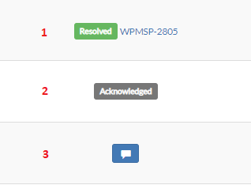
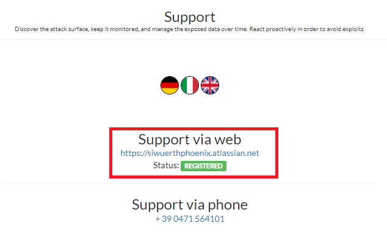
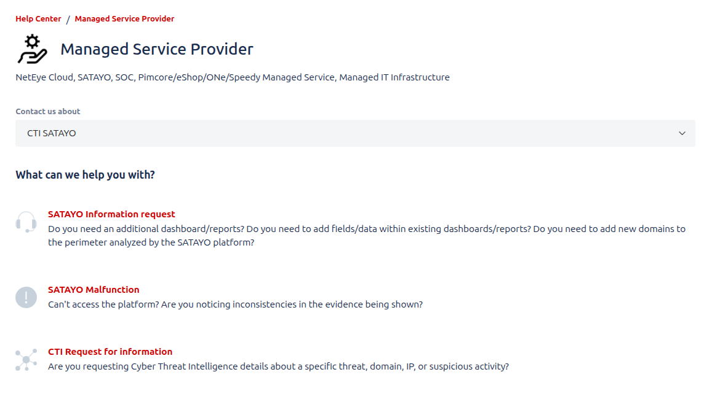
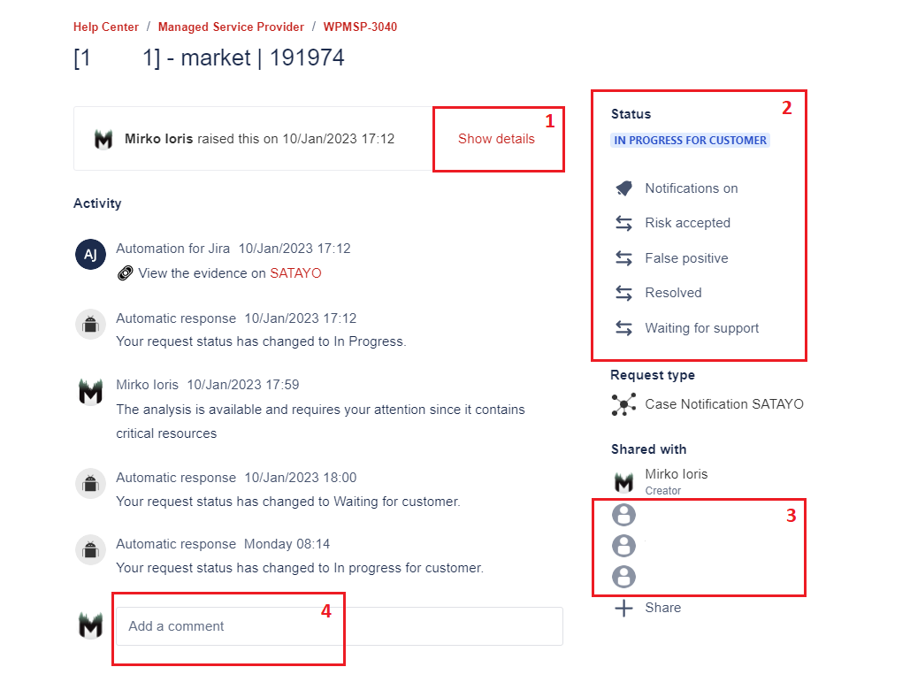
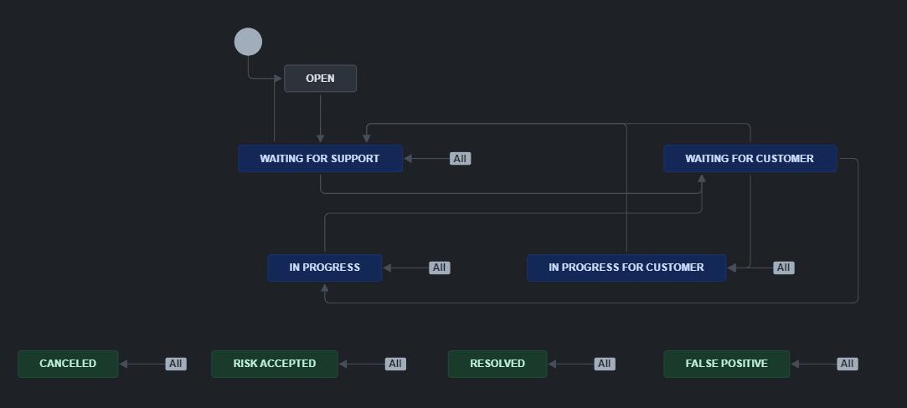
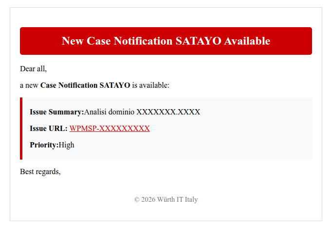

.. _managed:

****************
Managed Service
****************

The content described in this page is valid for the customers who possess the :command:`SaaS & Managed` version of SATAYO. If you don't have it you won't see
this features in SATAYO, but you can read here anyway to understand how it works.

|
|

General info
=============

After the initial scan is completed, SATAYO allows you download a report at any time in which the :command:`Exposure Assessment Index Value` is calculated based on the evidences found.
The procedure on how to do it was already explained in the section :ref:`How does SATAYO work<how-SATAYO-works>`. This applies to all the modalities in which SATAYO is offered, but with the :command:`SaaS & Managed` version
our team will periodically schedule a **one-hour meeting** with you to discuss the findings, align on what the platform is tracking, discuss any new domain to be added to the organization or any new keywords to be inserted.

|
|

Help Center
============

The `Help Center of Würth IT Italy <https://siwuerthphoenix.atlassian.net/servicedesk/customer/portals>`__, is the place where you can open tickets or requests for malfunctions, information, help with configurations or anything you need.

The Help Center is based on Atlassian Jira and you need a Jira account to open requests. In case you don't have it, it can be easily `created here <https://siwuerthphoenix.atlassian.net/servicedesk/customer/user/signup?destination=portals>`__.
Simply enter your email address and you will receive a link to finalize the registration.

SATAYO evidences are analyzed by our analysts and the analyses are communicated to you through this portal. The opening of tickets and their possible statuses is explained in :ref:`the next section<tickets-satayo>`.

|
|

.. _tickets-satayo:

Tickets in SATAYO
==================

Jira has been integrated into SATAYO, and in some sections such as domains, vulnerability, market, open bug bounty, general social and sandboxes, you will see a column called **Status**.

This column may show different options, depending on the status of the ticket. The possible scenarios you can encounter are the following three:

|
|

1. Status and ticket number: When a ticket is opened, progress and status changes are shown. The link points directly to the ticket in Jira. The status varies as the analysis proceeds.
2. Status Acknowledged: The evidence was reviewed by an analysts and marked as acknowledged. An acknowledged status opens an internal ticket, that can be shared with the customer if requested.
3. Blue icon: This evidence doesn't have an associated ticket. Clicking on the icon allows you to open a ticket for the selected evidence, where further analysis can be requested.

The :command:`Acknowledged` status indicates that an analysis was performed and the evidence was classified as *false positive* or *not dangerous*. This means there was no need to bother the client with a ticket and only an internal note was created.
If requested, the internal ticket containing the analysis can be shared.

.. note::
    Our analysts follow a logic and open tickets for suspicious evidences by prioritizing the most dangerous ones. You will be informed via email notification when a new analysis is available.

Status of the tickets can be checked from :file:`Settings -> Status Managed`. Here detailed information about tickets are shown. There is a link for each ticket that brings you to the Help Center where you can directly interact with it.
When the status of the ticket is in :command:`Waiting for Customer` it means it's your turn to open it, read what we analyzed and the mitigation we proposed and comment.

|

.. _tickets-opening:

How to open tickets
--------------------

In order to open tickets, your must have a Jira account associated to your SATAYO account. From :file:`Settings -> Support` you can check if your account is correctly activated.

|

If you see **REGISTERED** it means you won't have problem to open tickets.

In the same section, you’ll be able to submit general intelligence requests that trigger a one-off activity aimed at producing a specific output within a defined timeframe.
To do this, you need to complete the Requests form :ref:`Requests form<requests-form>`. In that section, you’ll also find a dedicated guide to help you fill out the form based on your specific needs.

|
|

.. _tickets-jira:

Tickets in Jira
================

Ticket interface
-----------------

When you open a link to a ticket, you will see an interface similar to this one:

|

1. Ticket details may be hidden if there are multiple comments under it, but they can be easily expanded with the :command:`Show details` button.
2. From this section the current status of the ticket is shown and you have the option to edit it.
3. Participants (people who can see and interact with the ticket) are listed here. Additional people can be added if necessary.
4. From here it is possible to comment on the ticket. After a customer comment, the status automatically changes and becomes *Waiting for Support*. Similarly, after an analyst comment, the status becomes *Waiting for Customer*. Your action in required when the ticket is in this status.

|

Ticket statuses
----------------

The following image shows the workflow of the different statuses of a ticket:

|

+ :command:`OPEN`, marked in GREY, is the first status of each ticket
+ :command:`IN PROGRESS`, :command:`IN PROGRESS FOR CUSTOMER`, :command:`WAITING FOR CUSTOMER`, :command:`WAITING FOR SUPPORT`, marked in BLUE, are the statuses that show the ticket is managed by someone, either a customer or an analyst.
+ :command:`RESOLVED`, :command:`CANCELED`, :command:`RISK ACCEPTED`, :command:`FALSE POSITIVE`, marked in GREEN, are the final statuses of each ticket. When the ticket is closed, it's in one of these four statuses.

|

Ticket fields
--------------

In addition to the status, every opened ticket has other important values: **Priority**, **TLP** and **Indicators**.

+ The priority value can range from Lowest, Low, Medium, High, Highest, and refers to the severity of the evidence.
+ The :abbr:`TLP (Traffic Light Protocol)` is the Traffic Light Protocol value, a standard created by `FIRST <https://www.first.org/tlp/>`__ that provides a simple and intuitive scheme for defining the level of sharing of potentially sensitive information. There are four levels of sharing: TLP:RED, TLP:AMBER, TLP:GREEN and TLP:CLEAR. The default level of the tickets is :command:`TLP:AMBER`.
+ Indicators are a collection of :abbr:`IoC (Indicator of Compromise)` and :abbr:`IoA (Indicator of Attack)` and can belong to different categories. They are explained below.

Indicators
~~~~~~~~~~~

Analysis activities may allow :abbr:`IoC (Indicator of Compromise)` or :abbr:`IoA (Indicator of Attack)` to be identified.
Sometimes it is sufficient to monitor these indicators, while at other times it is important to take active defensive actions against them.
When found, IoC and IoA are inserted in two ticket fields called :command:`Indicator` and :command:`Blacklist Indicator`.

The indicators inserted in the Blacklist Indicator field are collected by an automatic phase (which runs every 10 minutes) that populates a SATAYO table.
The table can be reached from :file:`Settings -> Indicators`. The collected indicators are divided into several files and made available to you.

An example of the types of indicators and the related links that can be used to download resources is shown below:

+--------------------+--------------------------------------------------------------------+
| Indicator Type     | Access for the customer                                            |
+====================+====================================================================+
| IP                 | https://indicatorblacklist.satayo.cloud/<customer_hash>_IP         |
+--------------------+--------------------------------------------------------------------+
| Domain             | https://indicatorblacklist.satayo.cloud/<customer_hash>_Domain     |
+--------------------+--------------------------------------------------------------------+
| Email              | https://indicatorblacklist.satayo.cloud/<customer_hash>_Email      |
+--------------------+--------------------------------------------------------------------+
| HASH               | https://indicatorblacklist.satayo.cloud/<customer_hash>_HASH       |
+--------------------+--------------------------------------------------------------------+
| URL                | https://indicatorblacklist.satayo.cloud/<customer_hash>_URL        |
+--------------------+--------------------------------------------------------------------+
| Other              | https://indicatorblacklist.satayo.cloud/<customer_hash>_Other      |
+--------------------+--------------------------------------------------------------------+

It's recommended to configure a schedule capable of downloading indicators every few minutes and automatically integrating them within your own infrastructure.

Some suggestions about possible usages:

+ **IP** - Integrate them within traffic drop rules on firewalling devices, to deny the ingoing/outgoing traffic to/from the IPs
+ **Domain** - Use them within traffic drop rules on mail servers
+ **Email** - These may come from SATAYO market evidences or Brute Force attempts. A suggested usage could be to convert the emails to the proper format in order to reset the password on authentication servers (e.g. AD server)
+ **HASH** - Use them on EDR software to filter out malicious software or within DFIR scenarios
+ **URL** - Use them on proxy to block malicious connections or on mail server to block links
+ **Other** - The usage of this type of evidence may vary as it may contain several different elements

.. _jiraalert:

Tickets Alerts
---------------

When a new analysis is completed and new report is available, you will be notified by email. In the email you will find a link that brings you directly to the ticket created in Jira.

