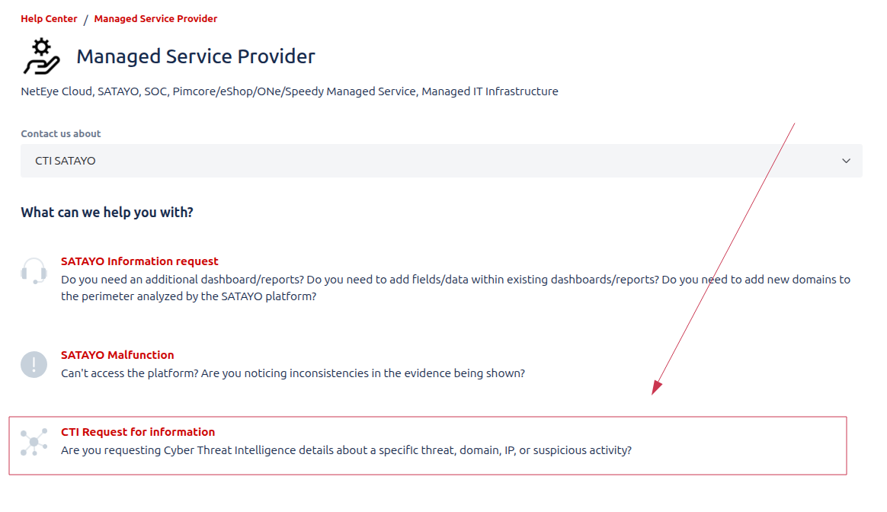
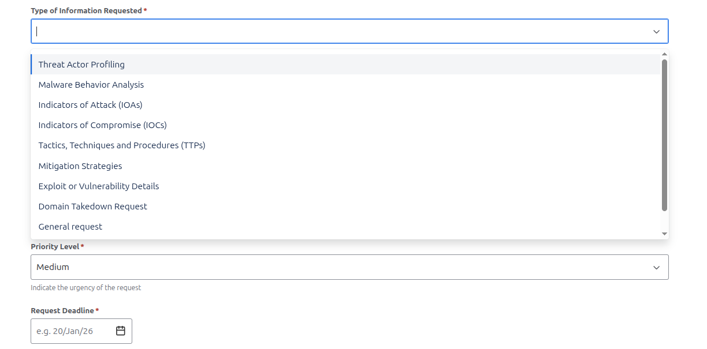
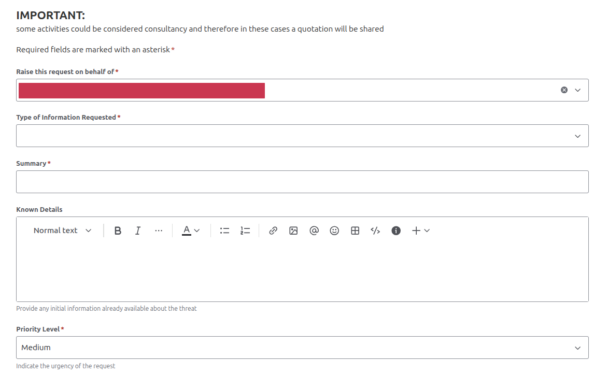
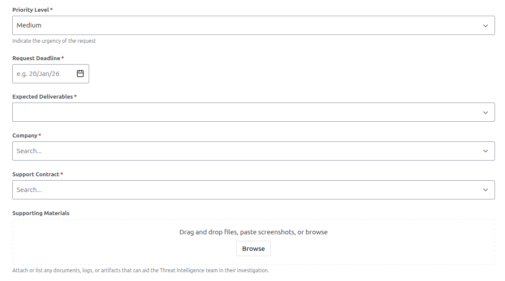
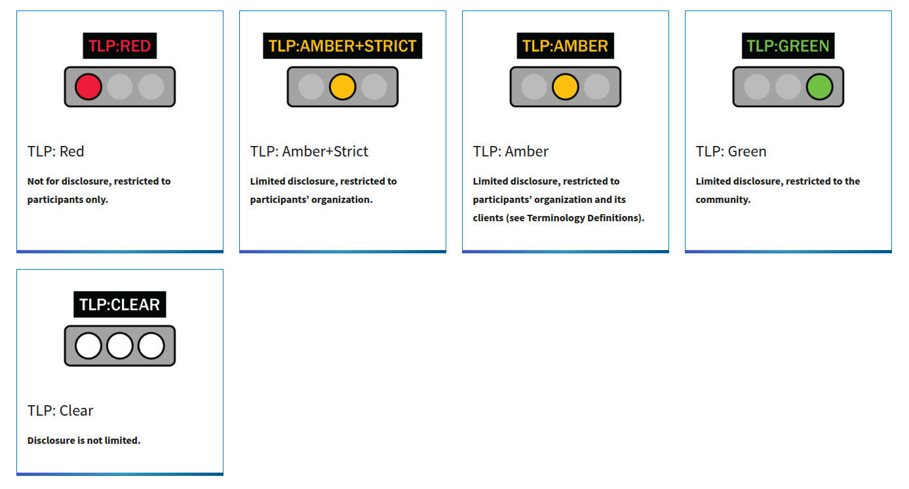

.. _requests-form:

**************
Request Form
**************

The form is designed to allow you to request specific Cyber Threat Intelligence activities beyond the standard SATAYO monitoring scope. It provides a direct channel to reach our analysts and request tailored investigations.
Each request will be reviewed by our team and, if accepted, you will be contacted to align on the scope, expected delivery timeline, and—where the requested activities fall outside those defined in your contract the associated costs.

|
|

The Form
=============

The first part of the form requires you to provide some basic information about yourself and your organization, and to specify the type of request you are submitting. You can choose from a list of predefined request types, such as:

|

+------------------------------------------+----------------------------------------------------------------------------------------------------------------------------------------------------------------------------------+
| REQUEST TYPE                             | DESCRIPTION                                                                                                                                                                      |
+==========================================+==================================================================================================================================================================================+
| THREAT ACTOR PROFILING                   | Analyzing an "attacker's identity", motives, and tactics to understand how and why threats occur. It helps organizations anticipate attacks and strengthen defensive strategies. |
+------------------------------------------+----------------------------------------------------------------------------------------------------------------------------------------------------------------------------------+
| MALWARE BEHAVIOUR ANALYSIS               | Examining how malicious software operates, spreads, and impacts systems. It helps identify threats and develop effective detection and mitigation strategies.                    |
+------------------------------------------+----------------------------------------------------------------------------------------------------------------------------------------------------------------------------------+
| INDICATORS OF ATTACK (IoAs)              | Identify patterns of behavior that signal an active or impending attack. They enable early detection and proactive response before damage occurs.                                |
+------------------------------------------+----------------------------------------------------------------------------------------------------------------------------------------------------------------------------------+
| INDICATOR OF COMPROMISE (IoCs)           | Are observable artifacts that confirm a system has been breached. They help detect, investigate, and respond to security incidents.                                              |
+------------------------------------------+----------------------------------------------------------------------------------------------------------------------------------------------------------------------------------+
| TACTICS, TECHNIQUES AND PROCEDURES       | Describe how threat actors plan, execute, and sustain attacks. They help defenders understand adversary behavior and improve threat detection and response.                      |
+------------------------------------------+----------------------------------------------------------------------------------------------------------------------------------------------------------------------------------+
| MITIGATION STRATEGIES                    | Are measures implemented to reduce the impact or likelihood of security threats. They help prevent attacks and limit damage when incidents occur.                                |
+------------------------------------------+----------------------------------------------------------------------------------------------------------------------------------------------------------------------------------+
| EXPLOIT OR VULNERABILITY DETAILS         | Describe weaknesses in systems and the methods used to take advantage of them. They help assess risk and guide timely patching and remediation efforts.                          |
+------------------------------------------+----------------------------------------------------------------------------------------------------------------------------------------------------------------------------------+
| DOMAIN TAKEOVER REQUEST                  | Involves identifying and reclaiming domains that are vulnerable or maliciously controlled. It helps prevent abuse, protect brand integrity, and reduce security risks.           |
+------------------------------------------+----------------------------------------------------------------------------------------------------------------------------------------------------------------------------------+

|

**Summary** and **Known Details** sections are key fields to provide as much context as possible about your request. This information helps our analysts understand your needs and deliver accurate results.

.. note::
    The know details section is particularly important for requests related to threat actors, malware, or specific incidents, as it allows you to share any relevant information you may already have, such information let analyst to contextualize the research and provide more precise outcomes.

|

In **Priority** and **Request Deadline** fields, you can indicate the urgency of your request. This information helps our team prioritize and manage workloads effectively. You can choose between three priority levels: Low, Medium, and High and specify a deadline date if applicable.

|

|

In the same section, you can also define the desidered output format for the request. The available options are:

+----------------------+----------------------------------------------------------------------------------------------------------------------------------------------------------------------------------+
| DESIDERED OUTPUT     | DESCRIPTION                                                                                                                                                                      |
+======================+==================================================================================================================================================================================+
| DETAILED REPORT      | Provides a comprehensive summary of findings, analysis, and evidence related to a security incident or a specific request.                                                       |
+----------------------+----------------------------------------------------------------------------------------------------------------------------------------------------------------------------------+
| SUMMARY OF FINDINGS  | Highlights the key observations and conclusions from the security analysis.                                                                                                      |
+----------------------+----------------------------------------------------------------------------------------------------------------------------------------------------------------------------------+
| IOC LIST             | A list of all identified Indicators of Compromise associated with an incident. It supports detection, investigation, and response across security systems                        |
+----------------------+----------------------------------------------------------------------------------------------------------------------------------------------------------------------------------+
| RAW ANALYSIS         | Contains data, logs, and observations collected during the investigation with a simple representation. Typically used for initial assessment and further detailed analysis.      |
+----------------------+----------------------------------------------------------------------------------------------------------------------------------------------------------------------------------+

In the **Attachments** section, you can upload any relevant files that may assist our analysts in understanding and addressing your request. This could include logs, screenshots, or any other supporting documentation. Least but not last, after filling all the required fields, you can also specify the TLP (Traffic Light Protocol) level for your request in the **TLP Level** section. The TLP is a system used to classify sensitive information and determine how it can be shared.

The available levels are:

|

+------------------+----------------------------------------------------------------------------------------------------------------------------------------------------------------------------------------------+
| TLP              | DESCRIPTION                                                                                                                                                                                  |
+==================+==============================================================================================================================================================================================+
| TLP CLEAR        | Disclosure is not limited. The output can be shared with any partner and us as intelligence team can consider the shared data as publicly available.                                         |
+------------------+----------------------------------------------------------------------------------------------------------------------------------------------------------------------------------------------+
| TLP GREEN        | Limited disclosure, restricted to the community. The output can be shared with restricted SATAYO community members only and provided data will be shared in accordance with TLP guidelines.  |
+------------------+----------------------------------------------------------------------------------------------------------------------------------------------------------------------------------------------+
| TLP AMBER        | Limited disclosure, restricted to participants’ organization and its clients. The output can be shared with restricted participants’ organization and its clients and stakeholders only.     |
+------------------+----------------------------------------------------------------------------------------------------------------------------------------------------------------------------------------------+
| TLP AMBER STRICT | Limited disclosure, restricted to participants’ organization. The output can be shared only within your organization.                                                                        |
+------------------+----------------------------------------------------------------------------------------------------------------------------------------------------------------------------------------------+
| TLP RED          | Not for disclosure, restricted to participants only. In this case a deciated team will handle the request and the information shared will be threated with the maximum confidentiality.      |
+------------------+----------------------------------------------------------------------------------------------------------------------------------------------------------------------------------------------+
