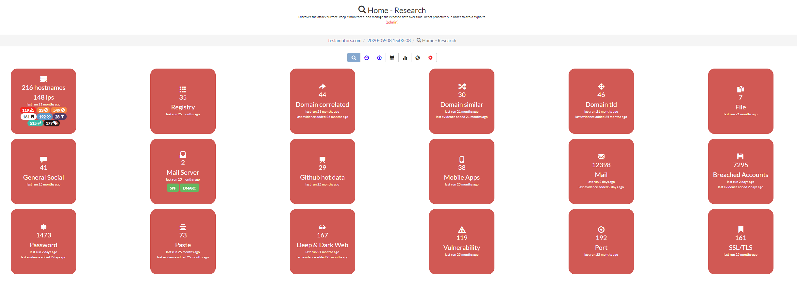
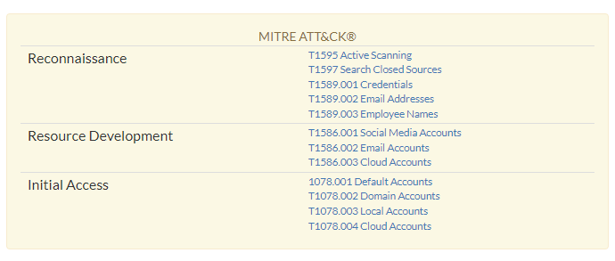
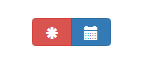
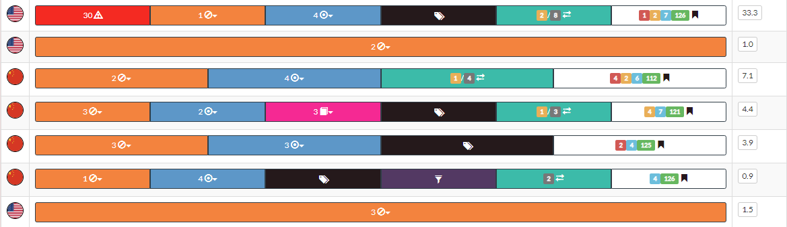
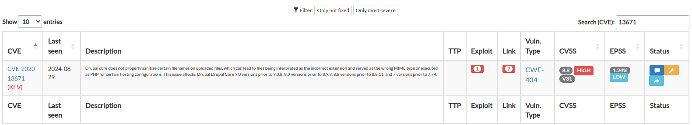
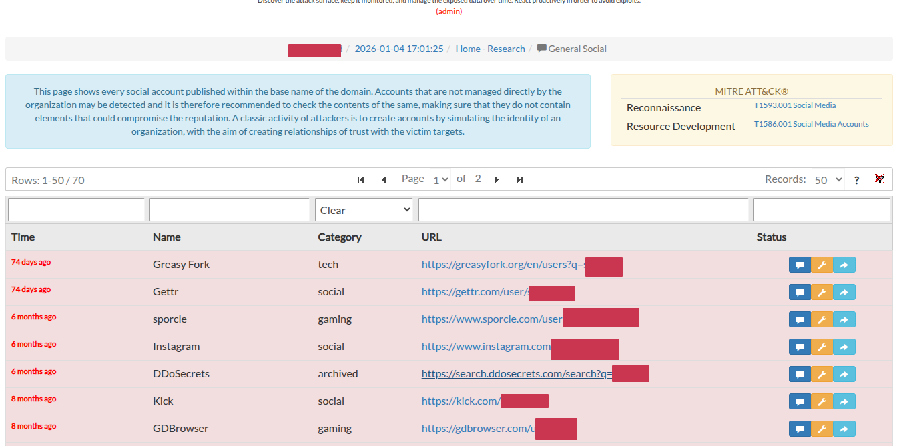
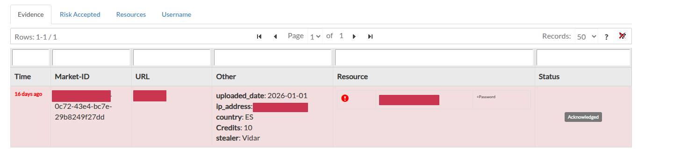
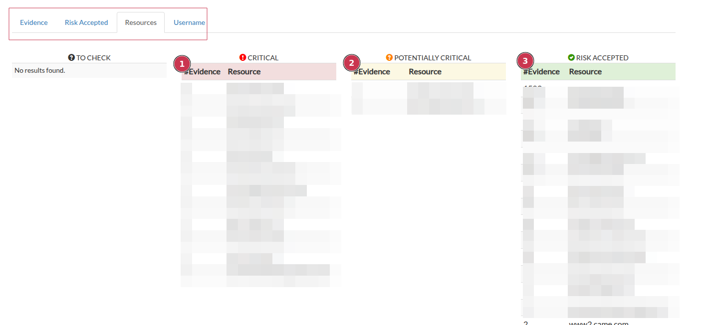
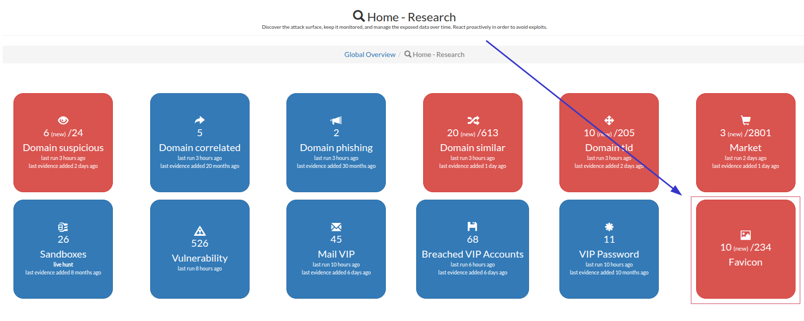
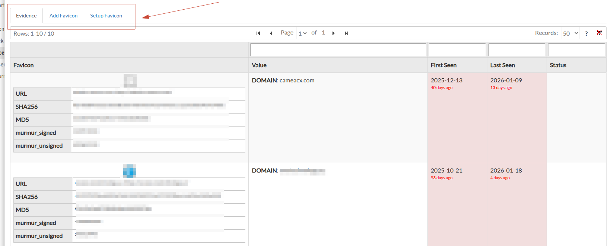

.. _satayo-items:

**************
SATAYO Items
**************

This page lists all the items collected by SATAYO, visible from the :abbr:`GUI (Graphical User Interface)`. The collected elements can vary from organization to organization
and it is possible that not all items are available for your search. This is not a bug, but the fact that SATAYO did not find anything related to your company in that specific category.
You can use this page to get a better understanding of what a certain section does and to get an idea of your overall exposure by comparing the evidence
found for your company with all the evidence analyzed. You can click on each item to explore it further.

This is an example analysis performed on the domain teslamotors.com.

Every item is correlated with the :command:`MITRE ATT&CK`, a framework for describing the behavior of cyber adversaries across their intrusion lifecycle.
More specifically, at the top of each item there is a table that maps the respective *Tactics* and *Techniques* used to retrieve it. The full table is available in the page :ref:`Mitre Attack Coverage<coverage>`.

These are the mappings for the Market section.

After opening an item, you will notice two buttons at the top of the page. With them you can filter the results and see only the data coming from the last scan.
Information about how often a scan is performed are available here, :ref:`How does SATAYO work<how-SATAYO-works>`.

The :command:`red` button shows only recently added data, while the :command:`blue` button shows everything. If blue is selected, new data are still marked in red to distinguish them from old evidence.

The next sections are dedicated to the collected items.

|
|

.. _hostname:

Hostname
=========

Hostnames are one of the starting points for SATAYO's exposure assessment analysis.
This page shows the hostnames found for the selected domain. Each hostname is resolved and its IP is also displayed, along with the country of origin.

If a **suitcase emoji** appears next to an IP address, it means that it is part of a subnet block managed directly by your organization.
More on this can be found in the section :ref:`Registry<registry>`.

If interesting items were found within the hostname, they are shown in the table to the right.
Each row also has a score value, and more information about the scoring can be found in the section :ref:`Global Report<global-report>`.

You can click on each result to explore the item further. A brief description of these subsections is provided below.

Vulnerability
--------------

This page shows the existence of vulnerabilities, identified by a :abbr:`CVE (Common Vulnerabilities and Exposures)` number and a
:abbr:`CVSS (Common Vulnerability Scoring System)` score, on exposed and domain-related resources. For the various CVEs, the link to the
U.S. National Vulnerability Database, maintained by the :abbr:`NIST (National Institute of Standards and Technology)`, and an indication of the type of vulnerability
listed within :abbr:`CWE (Common Weakness Enumeration)`, a system of categories used for software weaknesses and vulnerabilities, is given.
Links to existing exploits or :abbr:`PoC (Proof of Concept)` are also available.

For each vulnerability identified, its possible presence in the :abbr:`KEV (Known Exploited Vulnerabilities)` catalogue is also indicated. KEV is managed by `CISA <https://www.cisa.gov/known-exploited-vulnerabilities-catalog>`__.

The :abbr:`EPSS (Exploit Prediction Scoring System)` value is also shown, which is a data-driven effort for estimating the likelihood (probability) that a software vulnerability will be exploited in the wild.
The EPSS model produces a probability score between 0 and 1 (0 and 100%). The higher the score, the greater the probability that a vulnerability will be exploited.
EPSS is managed by `FIRST <https://www.first.org/epss/>`__, and SATAYO is present in the `official list <https://www.first.org/epss/who_is_using>`__ of EPSS supported vendors.

Vulnerabilities are scanned periodically; if one has been corrected and was not detected during the rescan, a **green tick** appears next to the vulnerability.

When you access this page from the :ref:`Hostname<hostname>` section, you will only see vulnerabilities related to the IP address you clicked on.
Otherwise, you can access this section directly from the menu, where you will see the data for every IP address within the domain.
Clicking on one of these IPs will redirect you back to the hostname section, but limited to the selected IP.

Blacklist host
---------------

This page shows the presence of host names within blacklists. This situation can compromise the provision of services and ruin reputations.
If browsers or organizations activate controls such as content filtering, the connection to the blacklisted machine may be terminated or refused.
Several blacklists allow users to request removal of their resources after a reputation check of the exposed resource.

Port
-----

This section consists of **seven** different subsections. The operation of each is explained below.
You can access this section directly from the main menu and see a list of all the evidences.
Otherwise, from the :ref:`Hostname<hostname>` section you can view details about an individual IP.

+-------------------------+-----------------------------------------------------------------------------------------------------------------------------------------------------------------------------------------------------------------------------------------------------------------------------------------------------------------+
| Pages                   | Description                                                                                                                                                                                                                                                                                                     |
+=========================+=================================================================================================================================================================================================================================================================================================================+
| Industrial systems      | This page shows exposed services, on domain-related IPs, related to protocols used within industrial systems (SCADA / ICS).                                                                                                                                                                                     |
+-------------------------+-----------------------------------------------------------------------------------------------------------------------------------------------------------------------------------------------------------------------------------------------------------------------------------------------------------------+
| Unencrypted protocols   | This page shows the exposure of services over protocols that transmit information in cleartext, such as http, ftp, imap, etc. These cleartext protocols may simplify the activity of network sniffing and consequent capture of confidential information.                                                       |
+-------------------------+-----------------------------------------------------------------------------------------------------------------------------------------------------------------------------------------------------------------------------------------------------------------------------------------------------------------+
| Interesting services    | This page shows exposed services that might be of interest to a malicious user. These services can be for example MySQL, MSSQL, Oracle database, LDAP, Tomcat, etc.                                                                                                                                             |
+-------------------------+-----------------------------------------------------------------------------------------------------------------------------------------------------------------------------------------------------------------------------------------------------------------------------------------------------------------+
| Port management         | This page shows exposed services, on domain-related IPs, related to remote management protocols (for example: vnc, rdp).                                                                                                                                                                                        |
+-------------------------+-----------------------------------------------------------------------------------------------------------------------------------------------------------------------------------------------------------------------------------------------------------------------------------------------------------------+
| Obsolete services       | This page shows exposed services, on domain-related IPs, related to obsolete protocols or services that are no longer recommended for use.                                                                                                                                                                      |
+-------------------------+-----------------------------------------------------------------------------------------------------------------------------------------------------------------------------------------------------------------------------------------------------------------------------------------------------------------+
| Web server NO SSL ports | This page shows exposed unencrypted web servers, reachable on port 80 or 8080.                                                                                                                                                                                                                                  |
+-------------------------+-----------------------------------------------------------------------------------------------------------------------------------------------------------------------------------------------------------------------------------------------------------------------------------------------------------------+
| Web server ports        | This page shows exposed web servers, reachable on ports typically used for HTTPS (such as 443).                                                                                                                                                                                                                 |
+-------------------------+-----------------------------------------------------------------------------------------------------------------------------------------------------------------------------------------------------------------------------------------------------------------------------------------------------------------+
| Wayback machine         | This page shows information retrieved from the Wayback Machine related to the domain. Old versions of sites may contain confidential information, so it is suggested to check them out.                                                                                                                         |
+-------------------------+-----------------------------------------------------------------------------------------------------------------------------------------------------------------------------------------------------------------------------------------------------------------------------------------------------------------+
| Technologies            | This page shows technologies detected on the domain-related IPs.                                                                                                                                                                                                                                                |
+-------------------------+-----------------------------------------------------------------------------------------------------------------------------------------------------------------------------------------------------------------------------------------------------------------------------------------------------------------+
| robots.txt              | This page shows the contents of the robots.txt file related to the domain.                                                                                                                                                                                                                                      |
+-------------------------+-----------------------------------------------------------------------------------------------------------------------------------------------------------------------------------------------------------------------------------------------------------------------------------------------------------------+
| HTTP method             | This page shows the HTTP methods supported by the web servers related to the domain.                                                                                                                                                                                                                            |
+-------------------------+-----------------------------------------------------------------------------------------------------------------------------------------------------------------------------------------------------------------------------------------------------------------------------------------------------------------+
| SSL/TLS                 | This page shows information about the SSL/TLS configuration of the web servers exposed. Checks performed may return evidence of expired SSL certificates or the use of obsolete and insecure cryptographic algorithms. Each evidence is tagged with a severity level ranging from CRITICAL to INFO.             |
+-------------------------+-----------------------------------------------------------------------------------------------------------------------------------------------------------------------------------------------------------------------------------------------------------------------------------------------------------------+

|
|

.. _registry:

Registry
=========

This page shows the subnet blocks where the found IP address reside. The records are managed by various :abbr:`RIRs (Regional Internet Registries)`.
If some IP blocks are managed directly by the organization, they are set as favorites and the addresses inside are scanned to see if there are other resolvable hostnames.

|
|

Domain related sections
========================

The following five items are grouped in this category in the guide as they all refer to domains. In SATAYO each of them has a single section.
For each domain found, information such as the registrant, country and creation date are shown, as well as the link to be able to verify the domain.

The **suitcase emoji** (green or blue) next to a domain means we were able to tell from the WHOIS data that it belongs to your organization or is part of your organization network.
If we were able to find information about MX records and presence in some blacklists, that data is also shown.
Customers in possess of the :command:`SaaS & Managed` version of SATAYO will see a column called *Status* from which it is possible to open tickets and request a detailed analysis of the selected evidence.
More information is available in the :ref:`Managed<managed>` page.

Domain suspicious
------------------

This page shows domains classified as suspicious because they contain the company's name inside.

Domain correlated
------------------

This page shows domains related to the main one. The correlation may result from similar elements present in the DNS record.

Domain phishing
----------------

This page shows known malicious domains or URLs that are currently performing phishing activities. The list of :abbr:`IOC (Indicator Of Compromise)` is updated frequently.

Domain similar
---------------

This page shows all registered domains similar to the main one. These domains could be used for phishing activities. If a domain was registered recently, chances are that it can be used for malicious purposes.

Domain tld
-----------

This page shows all top-level domain registered with the same base name as the main domain.

|
|

Potentially confidential data
==============================

The following three items are grouped in this category in the guide as they all may contain sensitive data. In SATAYO each of them has a single section.

File
-----

This page shows all files found in the domain analyzed at and with an extension deemed interesting. For each record some information is shown, such as the title, author, creation date, size, etc.
It is recommended to check the contents of these files and remove them from the Internet if they contain confidential information.
The link to the files is provided so that they can be verified.

Bucket
-------

This page shows the Amazon, Google, and Azure buckets and containers that belong to the organization.
If they are publicly accessible, the internal content is listed.

GitHub hot data
----------------

This page shows information deemed interesting obtained from GitHub repositories related to the scanned domain. It is possible that some files may contain confidential information.
Items such as users, passwords, certificate keys, configuration files, and log files were searched.
The link to the repository and the evidence found can be viewed in the list.

|
|

Mail server
============

This page shows the mail servers used by IPs within the scanned domain. The presence of :abbr:`SPF (Sender Policy Framework)` and :abbr:`DMARC (Domain-based Message Authentication)` is checked.
These are e-mail validation systems designed to detect e-mail spoofing attempts, with several checks performed before the message reaches the recipient.
If they are not present, it is recommended to enable them to avoid mail spoofing scenarios.

|
|

Mobile Apps
============

This page shows organization-related mobile applications uploaded to the Play Store or other third-party stores.
Applications are scanned periodically and different versions of the same application may be visible. If some antimalware engine detects malware in a version, it is flagged.

|
|

Personal information sections
==============================

The following items are grouped in this category as they all contain personal data of the employees. In SATAYO each of them has a single section.

Phone number
-------------

This page shows all phone numbers published on the institutional website of the analyzed domain.
If personal phone numbers are present, it is suggested to remove them as they may facilitate social engineering activities.

General Social
---------------

This page shows all the social presence of accounts named after the domain in analysis. Attackers may create accounts to simulate the identity of an organization, with the goal of establishing trust relationships with victims.

.. _email-monitoring:

Mail
-----

This page shows the email accounts belonging to the domain under analysis. It is reported whether the account was used to subscribe to an online service and if it is present in one or more data breaches.
From here it is possible to access the sections :ref:`Breached Accounts<breached>`, :ref:`Password<password>` and :ref:`Paste<paste>` and see the data related to the selected account.
Accessing the same sections from the global menu will show data for all the email addresses present.

Emails shown here were retrieved by SATAYO through OSINT analysis and were not validated. You may also see e-mails belonging to old employees.
We have added an enable/disable button to allow you to disable an old account and no longer receive notification about it.

There is also an option to classify emails as **VIP accounts**. These accounts are the one related to important corporate figures and their data is also shown in the :ref:`global overview<global-overview>`.
External VIP users mailboxes can also be monitored (e.g., gmail, yahoo, etc.).
If you are interested in adding external emails for VIP accounts, you must indicate this by opening a ticket. Once added, you will see the VIPs at the beginning of the page.

Lastly, under the column *Related Ticket*, links to opened tickets for that email address are displayed. This can be useful to understand which user is the most dangerous.

.. _breached:

Breached accounts
------------------

This page shows the presence of corporate e-mail addresses in different data breach scenarios. New data breaches are constantly being added.
For each breach, some information such as date, number of compromised accounts, and type of data contained is reported.
Results can be sorted by *last update* or by *date of breach*. Accounts can be set as verified after the owner has been informed and changed the password.
If there are passwords in the data breach, you can click on the e-mail address and view the password.

.. _password:

Password
---------

This page shows the passwords detected in the various data breaches, indicating the type of password.
For the hashes present, if available, the equivalent in plain text is shown. There is also a counter indicating how many times that password was found within the breaches.
All the passwords present within this list are **insecure** and should be changed immediately.

.. _paste:

Paste
------

This page shows the presence of corporate e-mail accounts within various paste sites. The content may not be available, as it is usually removed after a short time.
Although they may no longer be visible, the presence in multiple bonding sites may indicate that a data breach has occurred and that sensitive information may be at risk.

|
|

Open Bug Bounty
================

This page shows evidence of occurrences related to domain resources found within the Open Bug Bounty portal.
The portal allows an organization to manage the Vulnerability Disclosure activity in a coordinated way with the researchers who discover it.

|
|

Deep & Dark Web
================

This page contains evidence retrieved by SATAYO from Deep&Dark web sources, such as leak forums, onion sites, illegal marketplaces, social networks, etc.
The analysis is performed with several keywords related to the analyzed domain. The link of the mention and a snippet of it is given.

|
|

Market
=======

On this page, SATAYO shows evidence related to credentials, cookies, and sessions offered for sale within different marketplaces and coming from attacks
carried out using a log stealer malware. Stealers are a type of malware that is usually installed along with program cracks and is capable of stealing
personal information within the system, such as passwords stored in the browsers. We try as much as possible to maintain privacy and not let the market know our
interests, for example, to find amazon-related data, searches are done by searching for "azon" and the results filtered so that they contain only the items we
are really interested in.

Resources are classified with a severity level that can be **RISK ACCEPTED**, **POTENTIALLY CRITICAL** or **CRITICAL**, depending on the website within the log.
This classification is done by us, but you can request a change at any time if you feel that the severity of an item should be adjusted.
You can check how the resources were classified from the **Resources** tab in the market page.

In cases of CRITICAL resources, such as intranet websites, password managers, private clouds, administrative pages, etc., the item can be acquired and analyzed.
Purchasing a log prevents other criminals from accessing it and allows the owner of the infected machine to be discovered and informed of the theft of his or her personal information.

For POTENTIALLY CRITICAL resources that cannot be assessed by our team because they are not publicly accessible or currently unavailable, a ticket is opened asking the customer to assess the resource, which can then be set as CRITICAL or RISK ACCEPTED.

For resources with RISK ACCEPTED, no further analysis is performed.

In the Username tab you can check the resources within which the presence of usernames has been checked.

.. note::
    For customers with the :command:`SaaS & Managed` version of SATAYO, critical logs are obtained and analyzed by our team. The activity is carried out in compliance with current regulations and always respecting the privacy of the victim.
    Each SaaS & Managed customer will have access to a limited number of analysis based on their subscription plan.
    After the data and information have been processed and analyzed, you will be notified via a Jira ticket containing a complete analysis related to the data **related to your organization**, along with a full overview of recommended mitigations and best practices to help minimize the risk of future incidents.

Acquired logs may contain passwords and other personal information of the victim. We set limits (both technical and ethical) between what we can and cannot do.
**We don't test credentials to see if they are currently usable on related services and we don't share passwords in plaintext with customers.**
These activities are outside the scope of the Threat Intelligence service and don't help solve the problem. Additionally, sharing this data violates the target's privacy.
Victims should be informed of the compromise, clean up their computer as the stealer may still be present on the machine and change all their passwords.

|
|

Sandboxes
==========

This page shows the evidence found within sandboxes and related to the monitored organization. Evidence is detected using special YARA rules preconfigured by the team of analysts.
A sandbox detonates files into controlled virtual environments to track their activities and communications, producing detailed reports that include files opened, created and written, registry keys set, domains contacted, and more.

The URL of the analyzed evidence is provided, along with information on the country from which the file was uploaded and the size and extension of the file. It si worhth mentioning that the rule is build and defined starting from the :ref:`intelligence requirements<intelligence-requirements>` indicated by the customer.
The section also will contain malicious artifacts that exposes references to the monitored organization but also generic files that could be upload to sandboxes by unaware users. In the case of uploading confidential or critical files the report will contains direction to properly mitigate the exposure.

|
|

Credit Card
============

On this page, SATAYO shows evidence related to Credit Cards (CC) offered for sale within different marketplaces.
Information such as the name of the bank, the address of the card owner and the price at which the card is sold are shown if available.
CCs are stolen through a multitude of techniques, including, but not limited to, phishing emails, data breaches, sniffing on a public Wi-Fi network, physical cloning at ATMs, etc.

.. note::
    **This section is available only to credit institutions that issue credit cards.**

|
|

.. _favicon-items:

Favicon
========

This page is accessible only from the :ref:`GLOBAL OVERVIEW<global-overview>`. It allows you to manage and analyze the favicon icons related to the organization domain and other associated resources. The analysis of favicon can provide evidence useful for identifying and tracking exposed resources belonging to the organization.
The concept behind this kind of activities is that favicons are often reused across different services and platforms, making them a valuable indicator for identifying related assets. Sometimes, adversaries tends to use copy and import legitimite favicons in their phishing or malicious websites to make them appear more trustworthy to potential victims
**Using search engines like Shodan, SATAYO is able to identify other resources on the internet that use the same favicon, potentially revealing additional assets related to the organization.**.

In the **Evidence** tab, SATAYO shows the evidence of favicons found using matching techniques with favorite icons already present in the system. This allows analysts to track potential exposures or recognize reused favicon assets across different services.

.. _technologies-early-warning:

Technologies and Early Warning
==================================

SATAYO platform is able to identify technologies in use within the organization domain and related resources. Matching the data obtained from OSINT sources and the active scans of the web application exposed in the defined perimeter, SATAYO is able to provide a list of technologies in use. This information is useful for understanding part of the organization's technology stack exposed to the internet.
For the managed customers, this section is also useful for early warning activities. By knowing the technologies in use, the CTI nalysts can monitor for newly disclosed vulnerabilities or exploits related to those technologies and provide timely alerts to the organization.

In case a new vulnerability or exploit is detected related to a technology in use, a ticket is opened with all the relevant information and mitigation recommendations. This proactive approach helps the organization stay ahead of potential threats and take necessary actions to secure their systems as early measure to adopt after a critical vulnerability with know exploitation has been disclosed.

.. note::
    We use multiple metrics to classify the severity of a vulnerability, including :code:`CVSS score`, presence in :code:`KEV` list, availability of exploit code, and relevance to the organization's context.
    When these factors indicate a significant risk, we prioritize the alert and we'll create an ad-hoc ticket for the :ref:`managed<managed>` customers.
