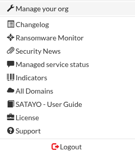
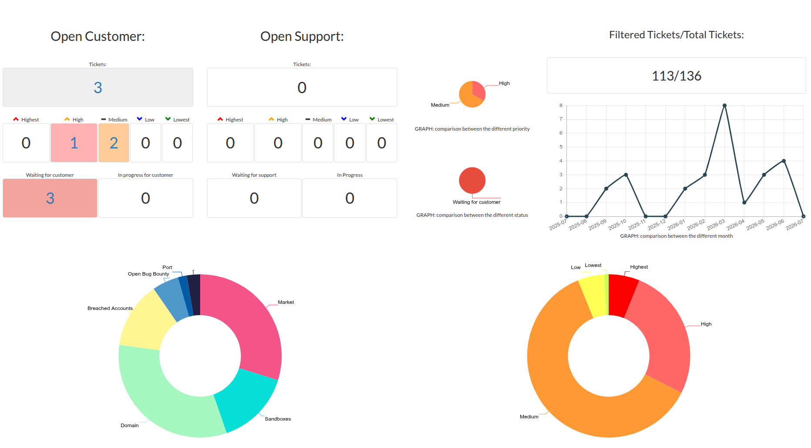
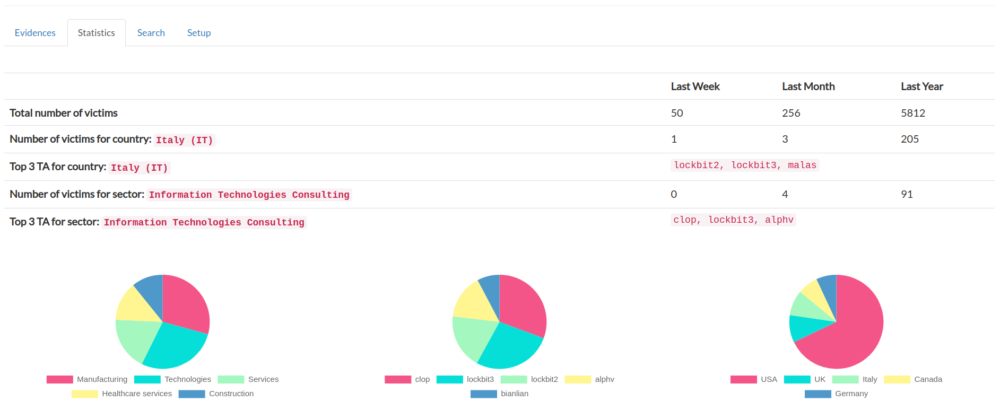

.. _settings:

*********
Settings
*********

This page will explore the content of the :command:`Settings`.

You can access the settings from the top right corner.

|
|

.. _user-info:

User information
=================

Clicking on the **email address** takes you to the user information page.

From here you can:

+ Change your name or password
+ Activate the :abbr:`2FA (Second Factor Authentication)` [RECOMMENDED]
+ Enable notifications for new findings, either via email or the SATAYO Telegram bot

|
|

.. _manage-your-org:

Manage your org [STATISTICS]
============================

The page shows information about your organization, such as the number of active users and the list of monitored domains.
The page also shows the status of the :ref:`Intelligence Requirements<maintain-req>`  configuration, which can be updated by opening a ticket or directly editing the configuration where applicable.

|
|

Changelog
==========

This page shows the changes made during the development of SATAYO. Each version is listed with the release date and the features that were added.

|
|

Ransomware Monitor
===================

This page shows information about ransomware attacks carried out worldwide. Data are retrieved from the **Dashboard Ransomware Monitor** project, available `here <https://ransomfeed.it/>`__.
It is possible to setup custom alerts and receive notifications when a company operating in the same sector and country has been attacked.
There is also the option to enter the list of customers and suppliers and be notified if one of them is the victim of a ransomware attack.

|
|

Security News
==============

This page contains Cyber Security news published by various authoritative sources. If anyone is interested, a link to the original article is provided.

|
|

Managed service status
=======================

This page is only available to customers with the :command:`SaaS & Managed` version of SATAYO.
It shows information about tickets and their status. Opened and resolved tickets can be easily tracked, as well as the evidence to which they relate.
Severity statistics are reported for open tickets. More details can be found in the section :ref:`Managed Service<managed>`.

|
|

Indicators
===========

This page is only available to customers with the :command:`SaaS & Managed` version of SATAYO.
It shows the list of indicators that were added to opened tickets. Indicators are IoC and IoA detected during the analysis.
Detailed information on the type of indicators collected are available in the paragraph :ref:`Tickets in Jira<tickets-jira>`.

|
|

All Domains
============

This page displays the list of domains associated with your organization that you may want to monitor. In the "Monitored" column you can see if the domain is already monitored. If the domain is not currently monitored but you want to monitor it, you can open a ticket specifying the domain and our analysts will take care of the request.

|
|

SATAYO - User Guide
====================

This button opens the guide you are reading right now. Hope you found what you were looking for :D

|
|

License
========

This page contains some useful information, such as the contract expiration date and the amount of credit used for the acquisition of market evidences.
Furthermore, the number of assets taken into consideration for the quotation of the service is indicated.

|
|

Support
========

This page contains links to our support channels. Here you can check whether your account can open tickets in Jira, as explained in :ref:`Tickets in SATAYO<tickets-satayo>`.
