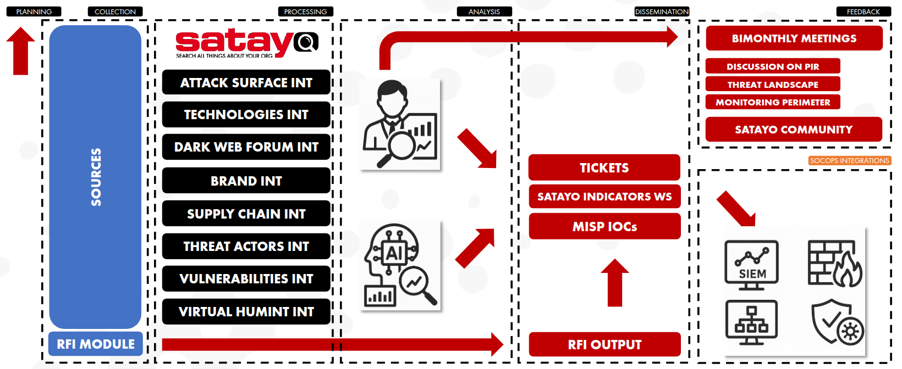

.. _the_intelligence_we_produce:

****************************
The Intelligence We Produce
****************************

Within our processes, aligned with the Threat Intelligence Lifecycle, we have the ability to produce different types of intelligence. Below we provide a brief description of how the steps in the Threat Intelligence Lifecycle are managed within our processes.

:command:`Planning`

**What it is:**
Define why we do Threat Intelligence and what questions we want to answer (PIRs – Priority Intelligence Requirements).

**What we manage:**

+ Definition and periodic review of PIRs with stakeholders

+ Alignment with business risks and monitoring perimeter

+ Continuous improvement loop (arrow back to Planning)

**Outcome:**
Clear intelligence objectives driving all downstream activities.

:command:`Collection`

**What it is:**
Gather raw data from multiple internal and external sources relevant to the PIRs.

**What we manage:**

Using SATAYO, we collect intelligence across multiple domains:

+------------------------------------------+----------------------------------------------------------------------------------------------------------------------------------------------------------------------------------+
| INTELLIGENCE TYPOLOGY                    | DESCRIPTION                                                                                                                                                                      |
+==========================================+==================================================================================================================================================================================+
| ATTACK SURFACE                           | Visibility into all internet-exposed assets (domains, IPs, services, cloud resources) to identify misconfigurations, shadow IT, and entry points attackers could exploit.        |
+------------------------------------------+----------------------------------------------------------------------------------------------------------------------------------------------------------------------------------+
| TECHNOLOGIES                             | Intelligence on hardware, software, operating systems, and platforms in use to assess technology-specific risks, exploitation trends, and exposure to known threats.             |
+------------------------------------------+----------------------------------------------------------------------------------------------------------------------------------------------------------------------------------+
| DARK WEB                                 | Monitoring of underground forums, marketplaces, and illicit channels to detect data leaks, credential sales, malware distribution, and emerging criminal activity.               |
+------------------------------------------+----------------------------------------------------------------------------------------------------------------------------------------------------------------------------------+
| BRAND                                    | Protection of corporate identity by identifying phishing campaigns, fake domains, impersonation, scams, and abuse of trademarks or executive identities.                         |
+------------------------------------------+----------------------------------------------------------------------------------------------------------------------------------------------------------------------------------+
| SUPPLY CHAIN                             | Intelligence on third parties, vendors, and partners to assess inherited risk, compromised suppliers, and cascading threats that could impact the organization indirectly.       |
+------------------------------------------+----------------------------------------------------------------------------------------------------------------------------------------------------------------------------------+
| THREAT ACTORS                            | Profiling and tracking of adversaries, including their motivations, capabilities, tools, infrastructure, and targeting patterns to anticipate and prioritize threats.            |
+------------------------------------------+----------------------------------------------------------------------------------------------------------------------------------------------------------------------------------+
| VULNERABILITIES                          | Collection and analysis of disclosed and zero-day vulnerabilities, exploitation status, and relevance to the organization’s environment to support risk-based remediation.       |
+------------------------------------------+----------------------------------------------------------------------------------------------------------------------------------------------------------------------------------+
| VIRTUAL HUMINT                           | Human intelligence gathered from online interactions, personas, and infiltration of digital communities to gain early insight into attacker intent, planning, and tactics.       |
+------------------------------------------+----------------------------------------------------------------------------------------------------------------------------------------------------------------------------------+
| INPUT FROM RFI                           | To collect and fulfill specific intelligence requirements requested through the Request For Information form.                                                                    |
+------------------------------------------+----------------------------------------------------------------------------------------------------------------------------------------------------------------------------------+

**Outcome:**
Large volumes of raw, heterogeneous threat data.

:command:`Processing`

**What it is:**
Transform raw data into structured, enriched, and usable information.

**What we manage:**

+ Data normalization and enrichment

+ De-duplication and correlation

**Outcome:**
Clean, contextualized intelligence ready for analysis.

:command:`Analysis`

**What it is:**
Turn processed information into actionable intelligence by answering the PIRs.

**What we manage:**

+ Threat assessment and risk evaluation

+ Correlation with internal context

+ Analyst-driven validation

+ AI-assisted processing to support prioritization and pattern recognition

**Outcome:**
Actionable intelligence with clear relevance and priority.

:command:`Dissemination`

**What it is:**
Deliver the right intelligence to the right audience, in the right format, at the right time.

**What we manage:**

Production of operational outputs:

+ Tickets

+ SATAYO Indicators Blacklist

+ MISP IOCs

+ RFI (Request For Information) outputs

**Outcome:**
Intelligence that directly supports detection, response, and decision-making.

:command:`Feedback`

**What it is:**
Evaluate the effectiveness of intelligence and refine future cycles.

**What we manage:**

+ Bimonthly meetings with stakeholders

Review of:

+ PIR relevance

+ Threat Landscape evolution

+ Monitoring perimeter effectiveness

+ Engagement with the SATAYO Community

+ Continuous tuning of sources, priorities, and outputs

**Outcome:**
A continuously improving Threat Intelligence program aligned with real needs.

|
|
